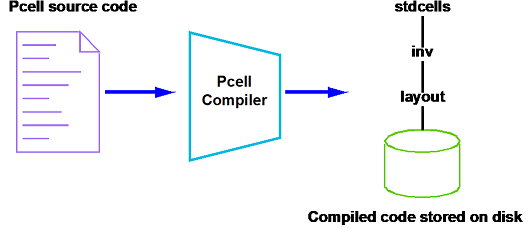
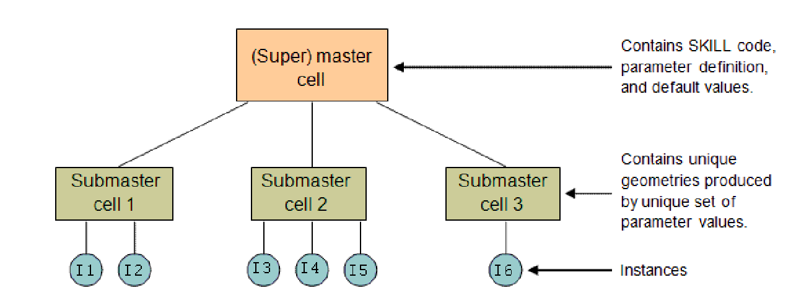

# Overview

Parameterized cells (PCells) is powerful way of creating automation using SKILL.

You can create PCells by:
- SKILL programming
- Using [PCell Designer][PCD]
- PCell menu from GUI but this is obsolete

Main principles of PCell SKILL coding:
- Using the pcDefinePCell function
- Creating PCell constructor functions
- Creating CDF parameters and callbacks
- Encrypting PCell codes

Coding is necessity for CAD engineers but can also enable to circuit designers to do complex activities efficiently.
For example:
Instead of drawing shapes for an in-house custom device and risk re-doing the whole device if any shape dimensions need to be changed, the layout designer can simply code it as a PCell and easily change the device layout as the parameters are updated.
Circuit designers can code schematic PCells that can change pin configurations as needed.
Parasitic techfile developers can code parallel line test structures as PCells so that the width and spacing of the test structures can be easily modified.

As basic knowledge of SKILL programming is required to follow this guide.

# PCell Supermaster and Submaster

The following points illustrate the concept of a PCell supermaster and submaster:



When you compile a SKILL PCell code (that is, load a SKILL file with the call of pcDefinePCell in CIW), a master/superMaster cell is created for it. The compiler attaches the compiled code to the master cell. The master cell contains the SKILL code of the cell’s definition along with the cell’s parameters and their default values.

A **SuperMaster** is the cell which is created with default parameters in the `Lib -> Cell -> View` format after the code is compiled and loaded. It resides on the hard disk as a `layout.oa` file.

If one or more parameters are modified, a copy of the supermaster with the modified parameters is created in the virtual memory. This is termed as a **submaster**. One submaster is created for every unique parameter combination.
Submasters are created in memory and are available for use by all cellViews. When parameters on an instance are modified, Virtuoso first checks if there is an existing submaster that contains the same unique set of modified parameters. If such a submaster is available, it will be reused. Otherwise, a new submaster will be created.



Submaster cell 1 represents a unique parameter combination of `L=10u` and `W=20u`. Instances I1 and I2 point to the same submaster. Similarly, submaster cell 2 is another unique parameter combination of `L=20u` and `W=30u`. Instances I3, I4, and I5 point to the same submaster.

# Basic PCell

Regardless of the complexity, all SKILL PCell code starts with the `pcDefinePCell` command, as shown below. Each call to `pcDefinePCell` creates one PCell master/superMaster cellview. You can create one source code file for each PCell or define several PCells in one file.

## lab1.il
```skill
;   Description   : Program to create a pcell that consists of a single rectangle with two parameters ‘w’ and ‘l’.

pcDefinePCell(
   list( ddGetObj("TestSkill") "pcell1" "layout")
   list((w 0.2) (l 0.1)) 
   let( (cv)
      cv=pcCellView
      dbCreateRect(cv list("MET1" "drawing") list(0:0 w:l))
   ) ;let
) ;pcDefineCell
```
The above SKILL code defines a simple PCell with the following features:
- PCell will be created in TestSkill/pcell1/layout.
- It consists of only a single rectangle.
- The Properties form of the PCell contains two parameters, w and l, which can be used to modify the size of the rectangle.

```
list( ddGetObj("TestSkill") "pcell1" "layout")
```
- This is a fixed syntax. Specify string inputs for library, cell, and view arguments. The `ddGetObj` command is only required for the library name. The "TestSkill" library should have already been pre-created in Library Manager.
```
list((w 0.2) (l 0.1))
```
- This is the list of PCell formal parameters and their default values.
```
let( (cv)
```
- The "let" command allows the declaration of local variables. As in all programming languages, usage of global variables should be minimized.
```
cv=pcCellView
```
- pcCellView is an internal variable automatically created by `pcDefinePCell`. pcCellView contains the dbId (database identification) of the cell you are creating. Assigning pcCellView to "cv" is to simply shorten the name of the variable so that it can be used more conveniently.
```
dbCreateRect(cv list("MET1" "drawing") list(0:0 w:l))
```
- PCell parameters `w` and `l` are used in the dbCreateRect command so that the PCell layout can be modified according to the values defined in the Properties form. bBox (bounding box) of the rectangle will be defined by the coordinates 0:0 (lowerLeft) and w:l (upperRight).

The codes can be used as follows:
- Start Virtuoso:
```bash
Linux> xt18-618
Linux> cdproj
Linux> cadstart
```
Compile the PCell by loading the SKILL script in CIW:
```
load("./scripts/lab1.il")
```
The following messages appear in CIW and the PCell myCell1 layout is generated in the myLib library.
```
Generating Pcell for 'pcell1 layout'.
t
```
The newly generated PCell can be tested as follows:

Click on  `CIW: File > Open > Cellview`, and open the cell named `lab` in myLib library. Place an instance of TestSkill/pcell1/layout in it. Modify w and l in the Properties form and note the changes in the PCell layout. For example, change w from 0.2 to 0.3.

The next step is to create CDF information for the PCell. Advantages of creating CDF include:
- Allows more variety in the input parameters (for example, instead of just a numeric field, radio fields and cyclic fields can also be used)
- Allows the specification of callbacks for each parameter
- Callback is a SKILL procedure which can do error checking, etc. when a parameter is modified
- Allows specification of default values for each parameter

Although the creation of CDF can be done using the Edit CDF form with `CIW: Tools > CDF > Edit`, this is usually done using SKILL commands in batch mode because of the large number of CDF parameters to be created.

A typical SKILL script for creating CDF is as shown below. It can be used as follows:
- Load the script in CIW:
```
load("./scripts/lab1_cdf.il")
```
## lab1_cdf.il
```
;   Description   : Program to create cdf information for the pcell.

let( ( lib cell libId cellId cdfId )
   lib="TestSkill"
   cell="pcell1"
   unless( cellId=ddGetObj(lib cell) error("Could not get cell %s." cell))
   when( cdfId=cdfGetBaseCellCDF(cellId) cdfDeleteCDF(cdfId))
   cdfId=cdfCreateBaseCellCDF(cellId)

   cdfCreateParam( cdfId
       ?name           "l"
       ?prompt         "l"
       ?defValue       0.1
       ?type           "float"
   ) ;cdfCreateParam

   cdfCreateParam( cdfId
       ?name           "w"
       ?prompt         "w"
       ?defValue       0.2
       ?type           "float"
   ) ;cdfCreateParam

    cdfSaveCDF( cdfId )
) ;let
```
Go to CIW: `Tools > CDF> Edit` and display CDF information for pcell1. It should now have two parameters.
This completes the creation of the basic PCell.


