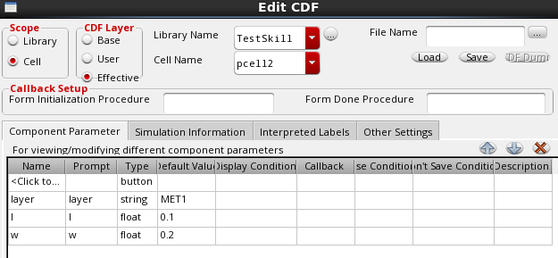
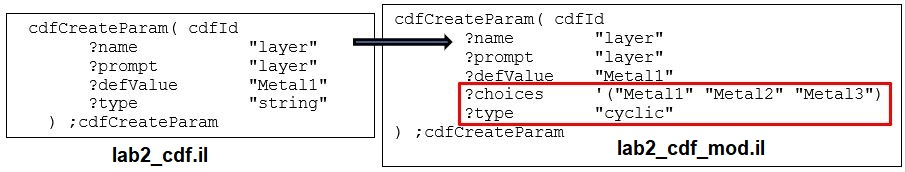
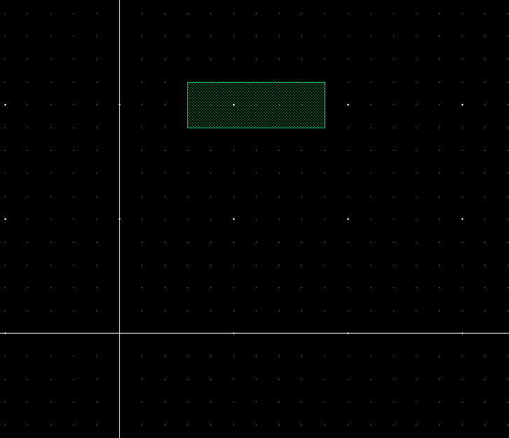
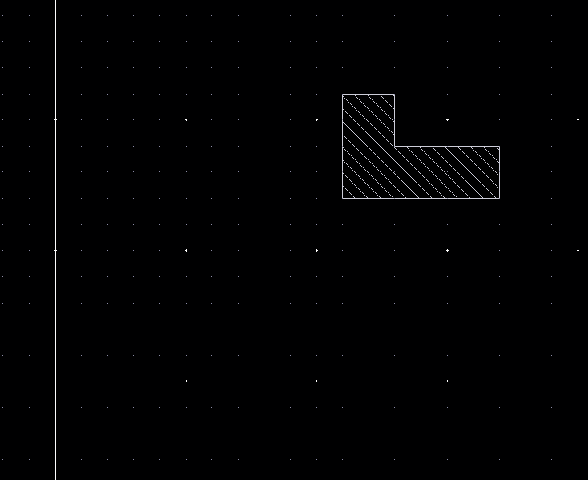
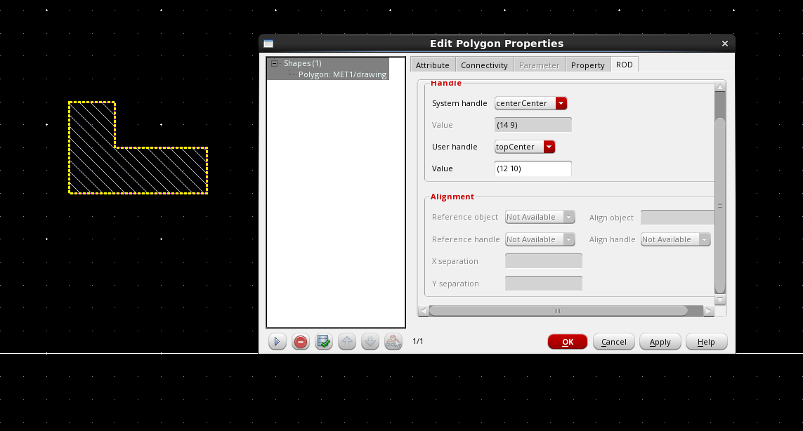
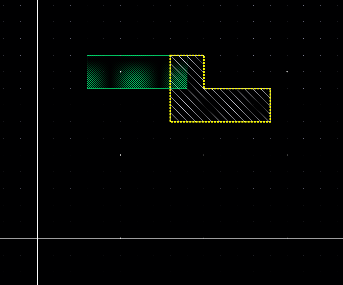
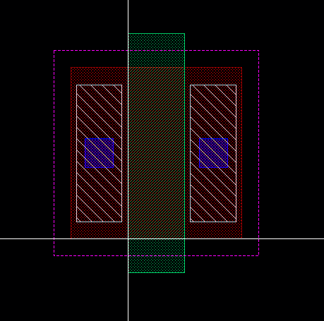
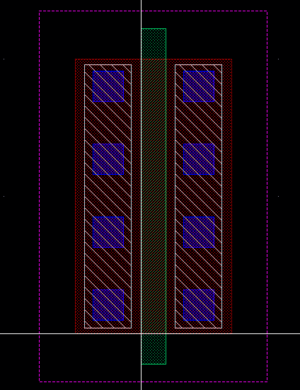

# Overview

Parameterized cells (PCells) is powerful way of creating automation using SKILL.

You can create PCells by:
- SKILL programming
- Using [PCell Designer](https://www.cadence.com/content/dam/cadence-www/global/en_US/documents/services/cadence-vcad-pcell-ds.pdf)
- PCell menu from GUI but this is obsolete

Main principles of PCell SKILL coding:
- Using the pcDefinePCell function
- Creating PCell constructor functions
- Creating CDF parameters and callbacks
- Encrypting PCell codes

Coding is necessity for CAD engineers but can also enable to circuit designers to do complex activities efficiently.
For example:
Instead of drawing shapes for an in-house custom device and risk re-doing the whole device if any shape dimensions need to be changed, the layout designer can simply code it as a PCell and easily change the device layout as the parameters are updated.
Circuit designers can code schematic PCells that can change pin configurations as needed.
Parasitic techfile developers can code parallel line test structures as PCells so that the width and spacing of the test structures can be easily modified.

As basic knowledge of SKILL programming is required to follow this guide.

# PCell Supermaster and Submaster

The following points illustrate the concept of a PCell supermaster and submaster:


When you compile a SKILL PCell code (that is, load a SKILL file with the call of pcDefinePCell in CIW), a master/superMaster cell is created for it. The compiler attaches the compiled code to the master cell. The master cell contains the SKILL code of the cell’s definition along with the cell’s parameters and their default values.

A **SuperMaster** is the cell which is created with default parameters in the `Lib -> Cell -> View` format after the code is compiled and loaded. It resides on the hard disk as a `layout.oa` file.

If one or more parameters are modified, a copy of the supermaster with the modified parameters is created in the virtual memory. This is termed as a **submaster**. One submaster is created for every unique parameter combination.
Submasters are created in memory and are available for use by all cellViews. When parameters on an instance are modified, Virtuoso first checks if there is an existing submaster that contains the same unique set of modified parameters. If such a submaster is available, it will be reused. Otherwise, a new submaster will be created.


Submaster cell 1 represents a unique parameter combination of `L=10u` and `W=20u`. Instances I1 and I2 point to the same submaster. Similarly, submaster cell 2 is another unique parameter combination of `L=20u` and `W=30u`. Instances I3, I4, and I5 point to the same submaster.

# Basic PCell

Regardless of the complexity, all SKILL PCell code starts with the `pcDefinePCell` command, as shown below. Each call to `pcDefinePCell` creates one PCell master/superMaster cellview. You can create one source code file for each PCell or define several PCells in one file.

## lab1.il
```skill
;   Description   : Program to create a pcell that consists of a single rectangle with two parameters ‘w’ and ‘l’.

pcDefinePCell(
   list( ddGetObj("TestSkill") "pcell1" "layout")
   list((w 0.2) (l 0.1)) 
   let( (cv)
      cv=pcCellView
      dbCreateRect(cv list("MET1" "drawing") list(0:0 w:l))
   ) ;let
) ;pcDefineCell
```
The above SKILL code defines a simple PCell with the following features:
- PCell will be created in TestSkill/pcell1/layout.
- It consists of only a single rectangle.
- The Properties form of the PCell contains two parameters, w and l, which can be used to modify the size of the rectangle.

```
list( ddGetObj("TestSkill") "pcell1" "layout")
```
- This is a fixed syntax. Specify string inputs for library, cell, and view arguments. The `ddGetObj` command is only required for the library name. The "TestSkill" library should have already been pre-created in Library Manager.
```
list((w 0.2) (l 0.1))
```
- This is the list of PCell formal parameters and their default values.
```
let( (cv)
```
- The "let" command allows the declaration of local variables. As in all programming languages, usage of global variables should be minimized.
```
cv=pcCellView
```
- pcCellView is an internal variable automatically created by `pcDefinePCell`. pcCellView contains the dbId (database identification) of the cell you are creating. Assigning pcCellView to "cv" is to simply shorten the name of the variable so that it can be used more conveniently.
```
dbCreateRect(cv list("MET1" "drawing") list(0:0 w:l))
```
- PCell parameters `w` and `l` are used in the dbCreateRect command so that the PCell layout can be modified according to the values defined in the Properties form. bBox (bounding box) of the rectangle will be defined by the coordinates 0:0 (lowerLeft) and w:l (upperRight).

The codes can be used as follows:
- Start Virtuoso:
```bash
Linux> xt18-618
Linux> cdproj
Linux> cadstart
```
Compile the PCell by loading the SKILL script in CIW:
```
load("./scripts/lab1.il")
```
The following messages appear in CIW and the PCell myCell1 layout is generated in the myLib library.
```
Generating Pcell for 'pcell1 layout'.
t
```
The newly generated PCell can be tested as follows:

Click on  `CIW: File > Open > Cellview`, and open the cell named `lab` in myLib library. Place an instance of TestSkill/pcell1/layout in it. Modify w and l in the Properties form and note the changes in the PCell layout. For example, change w from 0.2 to 0.3.

The next step is to create CDF information for the PCell. Advantages of creating CDF include:
- Allows more variety in the input parameters (for example, instead of just a numeric field, radio fields and cyclic fields can also be used)
- Allows the specification of callbacks for each parameter
- Callback is a SKILL procedure which can do error checking, etc. when a parameter is modified
- Allows specification of default values for each parameter

Although the creation of CDF can be done using the Edit CDF form with `CIW: Tools > CDF > Edit`, this is usually done using SKILL commands in batch mode because of the large number of CDF parameters to be created.

A typical SKILL script for creating CDF is as shown below. It can be used as follows:
- Load the script in CIW:
```
load("./scripts/lab1_cdf.il")
```
## lab1_cdf.il
```
;   Description   : Program to create cdf information for the pcell.

let( ( lib cell libId cellId cdfId )
   lib="TestSkill"
   cell="pcell1"
   unless( cellId=ddGetObj(lib cell) error("Could not get cell %s." cell))
   when( cdfId=cdfGetBaseCellCDF(cellId) cdfDeleteCDF(cdfId))
   cdfId=cdfCreateBaseCellCDF(cellId)

   cdfCreateParam( cdfId
       ?name           "l"
       ?prompt         "l"
       ?defValue       0.1
       ?type           "float"
   ) ;cdfCreateParam

   cdfCreateParam( cdfId
       ?name           "w"
       ?prompt         "w"
       ?defValue       0.2
       ?type           "float"
   ) ;cdfCreateParam

    cdfSaveCDF( cdfId )
) ;let
```
Go to CIW: `Tools > CDF> Edit` and display CDF information for pcell1. It should now have two parameters.
This completes the creation of the basic PCell.


# Adding Parameters to a PCell

Additional parameters can be easily added to the basic PCell by modifying the parameter line in the previous code. In the earlier SKILL code example (lab1.il), the rectangle uses a fixed layer (“MET1” “drawing”).
In the following SKILL codes, the layer of the rectangle has been parameterized so that it can be modified in the Properties form.

## lab2.il
```
;   Description   : Program to create a pcell that consists of a single rectangle with three parameters ‘w’, ‘l’ and 'layer'.

pcDefinePCell(
   list( ddGetObj("TestSkill") "pcell2" "layout")
   list((w 0.2) (l 0.1) (layer "MET1")) 
   let( (cv)
      cv=pcCellView
      dbCreateRect(cv list(layer "drawing") list(0:0 w:l))
   ) ;let
) ;pcDefineCell
```
The corresponding CDF creation script is:

## lab2_cdf.il
```
;   Description   : Program to create cdf information for the pcell.

let( ( lib cell libId cellId cdfId )
   lib="TestSkill"
   cell="pcell2"
   unless( cellId=ddGetObj(lib cell) error("Could not get cell %s." cell))
   when( cdfId=cdfGetBaseCellCDF(cellId) cdfDeleteCDF(cdfId))
   cdfId=cdfCreateBaseCellCDF(cellId)

   cdfCreateParam( cdfId
       ?name           "layer"
       ?prompt         "layer"
       ?defValue       "MET1"
       ?type           "string"
   ) ;cdfCreateParam

   cdfCreateParam( cdfId
       ?name           "l"
       ?prompt         "l"
       ?defValue       0.1
       ?type           "float"
   ) ;cdfCreateParam

   cdfCreateParam( cdfId
       ?name           "w"
       ?prompt         "w"
       ?defValue       0.2
       ?type           "float"
   ) ;cdfCreateParam

    cdfSaveCDF( cdfId )
) ;let
```
The new PCell and CDF codes can be used as follows:
Load the following scripts in CIW:
```
load("./scripts/lab2.il")
load("./scripts/lab2_cdf.il")
```
Create or open the layout cell "lab2" and place an instance of pcell2 in it. Select the instance, open the Edit Instance Properties form, and note the addition of the "layer" parameter.



A simple improvement to the PCell is to enhance the CDF parameters so that they allow users to input the values easily.



For example, instead of using a simple string field, which is prone to typos from users, a cyclic field can be used for layer input. This can be done by modifying the CDF codes as shown below and reloading the lab2_cdf.il file in CIW.


# Constructor Functions

Instead of putting all the required codes within the pcDefinePCell command, it is more common to use a SKILL procedure within pcDefinePCell to create the required shapes. This SKILL procedure is termed as a *constructor/wrapper* function because it "constructs" or “wraps” the body of the SKILL PCell. This is also referred to as PCell code encapsulation.

## lab3_constructor.il
```
procedure( CCScreatePcell3(cv w l layer)
   let( ()
  	dbCreateRect(cv list(layer "drawing") list(0:0 w:l))
   ) ;let
) ;procedure
```
## lab3.il
```
pcDefinePCell(
    list(ddGetObj("TestSkill") "pcell3" "layout")
    list((w 0.2) (l 0.1) (layer "MET1"))
    let((cv)
     	cv=pcCellView
     	CCScreatePcell3(cv w l layer)
   	)
)    
```
## lab3_cdf.il
```
let( ( lib cell libId cellId cdfId )
   lib="TestSkill"
   cell="pcell3"

   unless( cellId=ddGetObj(lib cell) error("Could not get cell %s." cell))
   when( cdfId=cdfGetBaseCellCDF(cellId) cdfDeleteCDF(cdfId))
   cdfId=cdfCreateBaseCellCDF(cellId)

   cdfCreateParam( cdfId
   	?name       	"layer"
   	?prompt     	"layer"
   	?defValue   	"MET1"
   	?choices    	'("MET1" "MET2" "MET3")
   	?type       	"cyclic"
   ) ;cdfCreateParam

   cdfCreateParam( cdfId
   	?name       	"l"
   	?prompt     	"l"
   	?defValue   	0.1
   	?type       	"float"
   ) ;cdfCreateParam

   cdfCreateParam( cdfId
   	?name       	"w"
   	?prompt     	"w"
   	?defValue   	0.2
   	?type       	"float"
   ) ;cdfCreateParam

	cdfSaveCDF( cdfId )
) ;let
```

Advantages of using constructor functions include:
- Modularize the codes and makes debugging easier
- Allows debugging for the constructor function to be done independently from the PCell itself
- Avoids repeated compilation of the PCell which can take significant time for complex PCells in advanced-node PDKs (The developer can now simply reload the constructor function which is usually placed in a separate file.)

The file containing the constructor functions can be encrypted as a context file to protect the PCell codes.

The new codes with constructor function can be tested by executing the following commands in CIW:
```
load("./scripts/lab3_constructor.il")
load("./scripts/lab3_cdf.il")
load("./scripts/lab3.il")
```
Next, create or open the layout cell "lab3" and place an instance of myCell3 to test it.

The file containing the constructor functions should be loaded first so that they can be used in the subsequent PCell compilation. Otherwise, there will be a PCell evaluation error during compilation.

As the codes that create the PCell are now separated from the pcDefinePCell function and hence, are not compiled directly into the PCell layout, they need to be always loaded once before the PCell can be used.

# CDF Callback Procedure
## lab5_constructor.il
```
procedure( CCScreatePcell5(cv w l layer)
   let( ()
      dbCreateRect(cv list(layer "drawing") list(0:0 w:l))
   ) ;let
) ;procedure
```

## lab5_callback.il
```
procedure( CCScheckParamValue5(param)
   let( (paramError value)
      paramError=nil
      value=cdfFindParamByName(cdfgData symbolToString(param))->value
      case( param
         (w
            cond(
               (value<0.2
                  paramError=t
                  value=0.2
               ) ;0.2
                (value>2.0
                  paramError=t
                  value=2.0
               ) ;2.0
            ) ;cond
         ) ;w
         (l
            cond(
               (value<0.1
                  paramError=t
                  value=0.1
               ) ;0.1
                (value>0.5
                  paramError=t
                  value=0.5
               ) ;0.5
            ) ;cond
         ) ;l
      ) ;case
            
      cdfFindParamByName(cdfgData symbolToString(param))->value=value
      when(paramError
         case( param
            (w error("Value of w must be within the range [0.2u,2.0u]"))
            (l error("Value of l must be within the range [0.1u,0.5u]"))
         ) ;case
      ) ;when
   ) ;let
) ;procedure
```

- ```cdfFindParamByName(g_cdfDataId t_name)```: Returns the parameter ID for the specified parameter name on the specified CDF description, if it exists. If not, it returns nil.  
- ```symbolToString(s_symbolName)```: It converts a symbol to a string of the same name.  

## lab5_cdf.il
```
let( ( lib cell view libId cellId cdfId )
   lib="TestSkill"
   cell="pcell5"
   view="layout"

   unless( ddGetObj(lib cell view)
      dbOpenCellViewByType(lib cell view "maskLayout" "w")
   ) ;unless

   unless( cellId=ddGetObj(lib cell) error("Could not get cell %s." cell))
   when( cdfId=cdfGetBaseCellCDF(cellId) cdfDeleteCDF(cdfId))
   cdfId=cdfCreateBaseCellCDF(cellId)

   cdfCreateParam( cdfId
       ?name           "layer"
       ?prompt         "layer"
       ?defValue       "MET1"
       ?choices        '("MET1" "MET2" "MET3")
       ?type           "cyclic"
   ) ;cdfCreateParam

   cdfCreateParam( cdfId
       ?name           "l"
       ?prompt         "l"
       ?defValue       0.1
       ?type           "float"
       ?callback       "CCScheckParamValue5('l)"
   ) ;cdfCreateParam

   cdfCreateParam( cdfId
       ?name           "w"
       ?prompt         "w"
       ?defValue       0.2
       ?type           "float"
       ?callback       "CCScheckParamValue5('w)"
   ) ;cdfCreateParam

    cdfSaveCDF( cdfId )
) ;let
```

## lab5.il
```
lib="TestSkill"
cell="pcell5"
cdf=cdfGetBaseCellCDF(ddGetObj(lib cell))

pcDefinePCell( 
   list( ddGetObj(lib) cell "layout")
   list(
      (w "float" cdf->w->defValue)
      (l "float" cdf->l->defValue)
      (layer "string" cdf->layer->defValue)
   ) ;list
   let( (cv)
      cv=pcCellView
      CCScreatePcell5(cv w l layer)
   ) ;let
) ;pcDefinePCell

lib=nil
cell=nil
cdf=nil 
```
Load the files in CIW in the following order:
```
load("./constructor.il")
load("./callback.il")
load("./cdf.il")
load("./pcell.il")
```
Next, create or open the layout cell "lab5" and place an instance of pcell5 to test it. callback procedure is called whenever user places an instance of pcell5 and trys to change the w, l value of the cell. The callback procedure sets the minimum and maximum value of the w and l parameters. In this case value of w is in between 0.2 to 2, whereas l can be in between 0.1 to 1. Change w, l parameter and check the whether w and l values are in between the desired range.

# Creating Layout Objects Using ROD

## About ROD
- ROD(Relative Object Design) is used to create objects and define their relationships at a high level of abstraction, so we can concentrate on our design objectives. ROD automatically handles the difficulty of traversing the design hierarchy and simplifies the calculations required to create and align geometries.
- Every named database object, such as an instance, layout cellview, or named shape, automatically has relative object design information associated with it. This information is stored in a ROD object. A ROD object is also a database object, but it exists in relation to its associated named database object. A ROD object is identified by a unique ROD object ID.
- A ROD object for a named shape, instance, or cellview contains the following information:
  - hierarchical name
  - cellview ID
  - database ID
  - transformation information (rotation, magnification, and offset)
  - alignment information, if any
  - number of segments (for shapes)
  - names and values of user-defined handles, if any
  - names of system-defined handles

## ROD functions
```
rodCreateRect(  
[ ?name S_name ]  
[ ?layer txl_layer ]  
[ ?width n_width ]  
[ ?length n_length ]  
[ ?origin l_origin ]  
[ ?bBox l_bBox ]  
[ ?elementsX x_elementsX ]  
[ ?elementsY x_elementsY ]  
[ ?spaceX n_spaceX ]  
[ ?spaceY n_spaceY ]  
[ ?cvId d_cvId ]  
[ ?fillBBox l_fillBBox ]  
[ ?fromObj Rl_fromObj ]  
[ ?size txf_size ]  
[ ?prop l_prop ]  
[ ?returnBoolean g_returnBoolean ]  
  
[rodRectConnectivityArgs... ]  
; start ROD Connectivity Arguments for Rectangles (rodRectConnectivityArgs)  
[ ?netName S_netName ]  
[ ?termName S_termName ]  
[ ?termIOType S_termIOType ]  
[ ?pin g_pin ]  
[ ?pinAccessDir tl_pinAccessDir ]  
[ ?pinLabel g_pinLabel ]  
[ ?pinLabelHeight n_pinLabelHeight ]  
[ ?pinLabelLayer txl_pinLabelLayer ]  
[ ?pinLabelFont S_pinLabelFont ]  
[ ?pinLabelDrafting g_pinLabelDrafting ]  
[ ?pinLabelOrient S_pinLabelOrient ]  
[ ?pinLabelOffsetPoint l_pinLabelOffsetPoint ]  
[ ?pinLabelJust S_pinLabelJust ]  
[ ?pinLabelRefHandle S_pinLabelRefHandle ]  
;end ROD Connectivity Arguments for Rectangles  
  
[ ?subRectArray l_subrectArgs... ]  
;start l_subrectArgs Subrectangle Arguments (l_subrectArgs)  
list(  
list(  
[ ?layer txl_layer ]  
[ ?width n_width ]  
[ ?length n_length ]  
[ ?gap S_gap ]  
[ ?lowerLeftOffsetX n_lowerLeftOffsetX ]  
[ ?lowerLeftOffsetY n_lowerLeftOffsetY ]  
[ ?upperRightOffsetX n_upperRightOffsetX ]  
[ ?upperRightOffsetY n_upperRightOffsetY ]  
[ ?spaceX n_spaceX ]  
[ ?spaceY n_spaceY ]  
[ ?prop l_prop ]  
;Repeat ROD Connectivity Arguments here  
);end first subrectangle list  
...  
) ;end all subrectangle lists  
;end l_subrectArgs  
)  
=> R_rodObj | t / nil 
```
  
Creates a single named rectangle, one or more rows and/or columns of named rectangles, or fills a bounding box with named rectangles, where each rectangle has ROD attributes. You can create these named rectangles with the arguments S_name through g_returnBoolean. Each named rectangle is a separate object, created at level zero in the hierarchy. You can also create multipart rectangles by specifying one or more arrays of unnamed subrectangles for each named rectangle, where each unnamed subrectangle is an ordinary database shape, with no ROD attributes, created at level zero in the hierarchy. The named rectangles in a multipart rectangle are referred to as master rectangles.

```
rodAlign(  
[ ?alignObj R_alignObj ]  
[ ?alignHandle S_alignHandle ]  
[ ?refObj R_refObj ]  
[ ?refHandle S_refHandle ]  
[ ?refPoint l_refPoint ]  
[ ?maintain g_maintain ]  
[ ?xSep txf_xSep ]  
[ ?ySep txf_ySep ]  
)  
=> R_rodObj / nil  
```
 
Aligns a named object by a point handle on that object to a specific point or to a point handle on a reference object. You can align objects that are at different levels of hierarchy as long as both objects are in the same top-level layout cellview. You can specify positive or negative separation between alignment points in the direction of both the X and Y axes, either as absolute distances or with Cadence SKILL language expressions. The system applies the offset from the reference point or reference object to the object to be aligned.

```
rodCreatePolygon(  
[ ?name S_name ]  
[ ?layer txl_layer ]  
[ ?pts l_pts ]  
[ ?cvId d_cvId ]  
[ ?fromObj Rl_fromObj ]  
[ ?size txf_size ]  
[ ?prop l_prop ]  
; ROD Connectivity Arguments for Polygons  
[ ?netName S_netName ]  
[ ?termName S_termName ]  
[ ?termIOType S_termIOType ]  
[ ?pin g_pin ]  
[ ?pinAccessDir tl_pinAccessDir ]  
[ ?pinLabel g_pinLabel ]  
[ ?pinLabelHeight n_pinLabelHeight ]  
[ ?pinLabelLayer txl_pinLabelLayer ]  
[ ?pinLabelFont S_pinLabelFont ]  
[ ?pinLabelDrafting g_pinLabelDrafting ]  
[ ?pinLabelOrient S_pinLabelOrient ]  
[ ?pinLabelOffsetPoint l_pinLabelOffsetPoint ]  
[ ?pinLabelJust S_pinLabelJust ]  
[ ?pinLabelRefHandle S_pinLabelRefHandle ]  
)  
=> R_rodObj / nil
```

Creates one polygon from a list of points or from one or more named objects. Also creates a ROD object containing information associated with the polygon, including its name and database ID. The associated ROD object is identified by a ROD object ID. The polygon is created at level zero in the hierarchy. You can assign a property name and value, or a list of property names and values, to the polygon. You can specify connectivity for the polygon by associating it with a specific terminal and net. You can also make the polygon into a pin.

```
rodCreateHandle(  
[ ?name S_name ]  
[ ?type S_type ]  
[ ?value g_value ]  
[ ?rodObj R_rodObj ]  
)  
=> t / nil  
```

Creates a user-defined handle for any ROD object (named shape, instance, or cellview); the object must be at level zero in the hierarchy. For example, you can create a handle for polyRect or for instance I1, but not for I1/polyRect.

## Creating a ROD Rectangle
We can create a ROD rectangle by typing below mentioned commands in the Command Interpreter Window (CIW): 
```
rect = rodCreateRect(
?name "rect"
?cvId geGetEditCellView()
?layer "POLY1"
?bBox list(3:11 9:9)
)
```

 


## Creating a ROD Polygon
A ROD Polygon can be created by typing below mentioned commands in the Command Interpreter Window (CIW): 
```
polygon = rodCreatePolygon(
?name "polygon"
?cvId geGetEditCellView()
?layer "MET1"
?pts list(11:11 11:7 17:7 17:9 13:9 13:11)
)
```

 

## About ROD Handles
Important attributes of ROD objects are their handles. Handles are used to store points, calculations, and other information. In the Edit Properties form you can view the handle data in the ROD fields.

## Creating User-Defined Handles
In this section, we will create a user-defined handle for the polygon. When we define a user-defined handle, we specify a name and assign a value to it. The values of user-defined handles are stored in the database.
To create a user-defined handle,
1. In the CIW, type
   ```
   rodCreateHandle(
   ?name "topCenter"
   ?type "point"
   ?value 12:10
   ?rodObj polygon
   )
   ```
   
2. Note the change in the User handle field. We may have to deselect and then reselect the polygon to refresh the form. The value should reflect what we set to create the user handle.

 

## Aligning the ROD Polygon and Rectangle
An important feature of ROD is the ability to specify the position of one named object in relation to another named object. This is called relative alignment. Usually, we align objects by specifying a point handle on each object. We can also specify the distance between the two objects in the direction of the X axis, the Y axis, or both. The alignment between two objects is preserved when you manipulate either object and when we save and close the layout cellview. In this section, we align the polygon and rectangle. The reference object is the rectangle and the reference handle is centerRight. The align object is the polygon and the align handle is topCenter. Remember, topCenter is the user handle we just created.  
In the CIW, type  
```
rodAlign(
?alignObj polygon
?alignHandle "topCenter"
?refObj rect
?refHandle "centerRight"
)
```
 


# creating a mosfet pcell
## lab6_constrctor.il
```
procedure( CCScreatePcell6(cv w l)
   let( (drainRod sourceRod bodyRod gateRod drainMetRod sourceMetRod)
      drainRod=rodCreateRect(
         ?cvId cv
         ?layer "DIFF"
         ?bBox list(0:0 l:w)
         ?netName "D"
         ?termName "D"
         ?termIOType "inputOutput"
         ?pin t
      ) ;rodCreateRect

      sourceRod=rodCreateRect(
         ?cvId cv
         ?layer "DIFF"
         ?bBox list(0:0 l:w)
         ?netName "S"
         ?termName "S"
         ?termIOType "inputOutput"
         ?pin t
      ) ;rodCreateRect

      bodyRod=rodCreateRect(
         ?cvId cv
         ?layer "DIFF"
         ?bBox list(0:0 l:w)
      ) ;rodCreateRect

      gateRod=rodCreateRect(
         ?cvId cv
         ?layer "POLY1"
         ?bBox list(0:0 l:w*1.4)
      ) ;rodCreateRect

      contRod1=rodCreateRect(
         ?cvId cv
         ?layer "CONT"
         ?bBox list(0:0 0.05:0.05)
      ) ;rodCreateRect

      contRod2=rodCreateRect(
         ?cvId cv
         ?layer "CONT"
         ?bBox list(0:0 0.05:0.05)
      ) ;rodCreateRect

      nimpRod=rodCreateRect(
         ?cvId cv
         ?layer "NIMP"
         ?bBox list(0:0 3.6*l:w*1.2)
      ) ;rodCreateRect

      rodAlign(
         ?alignObj drainRod
         ?alignHandle "lowerRight"
         ?refObj bodyRod
         ?refHandle "lowerLeft"
      ) ;rodAlign

      rodAlign(
         ?alignObj sourceRod
         ?alignHandle "lowerLeft"
         ?refObj bodyRod
         ?refHandle "lowerRight"
      ) ;rodAlign

      rodAlign(
         ?alignObj gateRod
         ?alignHandle "centerCenter"
         ?refObj bodyRod
         ?refHandle "centerCenter"
      ) ;rodAlign

      drainMetRod=rodCreateRect(
         ?cvId cv
         ?layer "MET1"
         ?bBox list(0:0 l*0.8:w*0.8)
         ?netName "D"
         ?pin t
      ) ;rodCreateRect

      sourceMetRod=rodCreateRect(
         ?cvId cv
         ?layer "MET1"
         ?bBox list(0:0 l*0.8:w*0.8)
         ?netName "S"
         ?pin t
      ) ;rodCreateRect

      rodAlign(
         ?alignObj nimpRod
         ?alignHandle "centerCenter"
         ?refObj gateRod
         ?refHandle "centerCenter"
      ) ;rodAlign

      rodAlign(
         ?alignObj drainMetRod
         ?alignHandle "centerCenter"
         ?refObj drainRod
         ?refHandle "centerCenter"
      ) ;rodAlign

      rodAlign(
         ?alignObj sourceMetRod
         ?alignHandle "centerCenter"
         ?refObj sourceRod
         ?refHandle "centerCenter"
      ) ;rodAlign

      rodAlign(
         ?alignObj contRod1
         ?alignHandle "centerCenter"
         ?refObj drainMetRod
         ?refHandle "centerCenter"
      ) ;rodAlign

      rodAlign(
         ?alignObj contRod2
         ?alignHandle "centerCenter"
         ?refObj sourceMetRod
         ?refHandle "centerCenter"
      ) ;rodAlign

   ) ;let
) ;procedure
```
## lab6_cdf.il
```
let( ( lib cell view libId cellId cdfId )
   lib="TestSkill"
   cell="pcell6"
   view="layout"

   unless( ddGetObj(lib cell view)
      dbOpenCellViewByType(lib cell view "maskLayout" "w")
   ) ;unless

   unless( cellId=ddGetObj(lib cell) error("Could not get cell %s." cell))
   when( cdfId=cdfGetBaseCellCDF(cellId) cdfDeleteCDF(cdfId))
   cdfId=cdfCreateBaseCellCDF(cellId)

   cdfCreateParam( cdfId
       ?name           "l"
       ?prompt         "l"
       ?defValue       0.1
       ?type           "float"
       ?callback       "CCScheckParamValue6('l)"
   ) ;cdfCreateParam

   cdfCreateParam( cdfId
       ?name           "w"
       ?prompt         "w"
       ?defValue       0.3
       ?type           "float"
       ?callback       "CCScheckParamValue6('w)"
   ) ;cdfCreateParam

    cdfSaveCDF( cdfId )
) ;let
```
## lab6_callback.il
```
procedure( CCScheckParamValue6(param)
   let( (paramError value)
      paramError=nil
      value=cdfFindParamByName(cdfgData symbolToString(param))->value
      case( param
         (w
            cond(
               (value<0.2
                  paramError=t
                  value=0.2
               ) ;0.2
                (value>2.0
                  paramError=t
                  value=2.0
               ) ;2.0
            ) ;cond
         ) ;w
         (l
            cond(
               (value<0.18
                  paramError=t
                  value=0.18
               ) ;0.18
                (value>0.5
                  paramError=t
                  value=0.5
               ) ;0.5
            ) ;cond
         ) ;l
      ) ;case
            
      cdfFindParamByName(cdfgData symbolToString(param))->value=value
      when(paramError
         case( param
            (w error("Value of w must be within the range [0.2u,2.0u]"))
            (l error("Value of l must be within the range [0.18u,0.5u]"))
         ) ;case
      ) ;when
   ) ;let
) ;procedure
```
## lab6.il

```
lib="TestSkill"
cell="pcell6"
cdf=cdfGetBaseCellCDF(ddGetObj(lib cell))

pcDefinePCell(
   list(ddGetObj(lib) cell "layout")
   list(
      (w "float" cdf->w->defValue)
      (l "float" cdf->l->defValue)
   ) ;list
   let( (cv)
      cv=pcCellView
      CCScreatePcell6(cv w l)
   ) ;let
) ;pcDefinePCell

lib=nil
cell=nil
cdf=nil
```

Load the files in CIW in the following order:  
load("./constructor.il")  
load("./callback.il")  
load("./cdf.il")  
load("./pcell.il")  

 

<<<<<<< HEAD
Vishal
=======
# Modifications in a NMOS pcell

Here we are trying to create a standard xfab NMOS with array of diffusion contacts and align them one by one. Except lab6 constructor function all the SKILL files are same.

## lab7_constructor.il
```
procedure( CCScreatePcell7(cv w l)
   let( (drainRod sourceRod bodyRod gateRod drainMetRod sourceMetRod)
      drainRod=rodCreateRect(
         ?cvId cv
         ?layer "DIFF"
         ?bBox list(0:0 0.48:w)
         ?netName "D"
         ?termName "D"
         ?termIOType "inputOutput"
         ?pin t
      ) ;rodCreateRect

      sourceRod=rodCreateRect(
         ?cvId cv
         ?layer "DIFF"
         ?bBox list(0:0 0.48:w)
         ?netName "S"
         ?termName "S"
         ?termIOType "inputOutput"
         ?pin t
      ) ;rodCreateRect

      bodyRod=rodCreateRect(
         ?cvId cv
         ?layer "DIFF"
         ?bBox list(0:0 l:w)
      ) ;rodCreateRect

      gateRod=rodCreateRect(
         ?cvId cv
         ?layer "POLY1"
         ?bBox list(0:0 l:2.44)
      ) ;rodCreateRect

arrayOfDiffCon0  = rodCreateRect( ?cvId cv
				  ?name "arrayOfDiffCon0" 
				  ?layer "CONT" 
				  ?width 0.22
				  ?length 0.22
            			  ?elementsX 1 
                                  ?elementsY 4 
				  ?spaceY 0.225 )

arrayOfDiffCon1  = rodCreateRect( ?cvId cv
				  ?name "arrayOfDiffCon1" 
				  ?layer "CONT" 
				  ?width 0.22
				  ?length 0.22
            			  ?elementsX 1 
                                  ?elementsY 4 
				  ?spaceY 0.225 )

      nimpRod=rodCreateRect(
         ?cvId cv
         ?layer "NIMP"
         ?bBox list(0:0 (1.48+l):2.7)
      ) ;rodCreateRect

      drainMetRod=rodCreateRect(
         ?cvId cv
         ?layer "MET1"
         ?bBox list(0:0 0.34:w*0.96)
         ?netName "D"
         ?pin t
      ) ;rodCreateRect

      sourceMetRod=rodCreateRect(
         ?cvId cv
         ?layer "MET1"
         ?bBox list(0:0 0.34:w*0.96)
         ?netName "S"
         ?pin t
      ) ;rodCreateRect

      rodAlign(
         ?alignObj drainRod
         ?alignHandle "lowerRight"
         ?refObj bodyRod
         ?refHandle "lowerLeft"
      ) ;rodAlign

      rodAlign(
         ?alignObj sourceRod
         ?alignHandle "lowerLeft"
         ?refObj bodyRod
         ?refHandle "lowerRight"
      ) ;rodAlign

      rodAlign(
         ?alignObj gateRod
         ?alignHandle "centerCenter"
         ?refObj bodyRod
         ?refHandle "centerCenter"
      ) ;rodAlign

      rodAlign(
         ?alignObj nimpRod
         ?alignHandle "centerCenter"
         ?refObj gateRod
         ?refHandle "centerCenter"
      ) ;rodAlign

      rodAlign(
         ?alignObj drainMetRod
         ?alignHandle "centerCenter"
         ?refObj drainRod
         ?refHandle "centerCenter"
      ) ;rodAlign

      rodAlign(
         ?alignObj sourceMetRod
         ?alignHandle "centerCenter"
         ?refObj sourceRod
         ?refHandle "centerCenter"
      ) ;rodAlign

      rodAlign(
         ?alignObj rodGetObj("arrayOfDiffCon0.1" cv)
         ?alignHandle "lowerCenter"
         ?refObj drainMetRod
         ?refHandle "lowerCenter"
         ?xSep 0.0
         ?ySep 0.06
      ) ;rodAlign

      rodAlign(
         ?alignObj rodGetObj("arrayOfDiffCon0.2" cv)
         ?alignHandle "lowerCenter"
         ?refObj drainMetRod
         ?refHandle "lowerCenter"
         ?xSep 0.0
         ?ySep (0.37+0.22)
      ) ;rodAlign

      rodAlign(
         ?alignObj rodGetObj("arrayOfDiffCon0.3" cv)
         ?alignHandle "lowerCenter"
         ?refObj drainMetRod
         ?refHandle "lowerCenter"
         ?xSep 0.0
         ?ySep (0.68+0.22+0.22)
      ) ;rodAlign

      rodAlign(
         ?alignObj rodGetObj("arrayOfDiffCon0.4" cv)
         ?alignHandle "lowerCenter"
         ?refObj drainMetRod
         ?refHandle "lowerCenter"
         ?xSep 0.0
         ?ySep (0.99+0.22+0.22+0.22)
      ) ;rodAlign

      rodAlign(
         ?alignObj rodGetObj("arrayOfDiffCon1.1" cv)
         ?alignHandle "lowerCenter"
         ?refObj sourceMetRod
         ?refHandle "lowerCenter"
         ?xSep 0.0
         ?ySep 0.06
      ) ;rodAlign

      rodAlign(
         ?alignObj rodGetObj("arrayOfDiffCon1.2" cv)
         ?alignHandle "lowerCenter"
         ?refObj sourceMetRod
         ?refHandle "lowerCenter"
         ?xSep 0.0
         ?ySep (0.37+0.22)
      ) ;rodAlign

      rodAlign(
         ?alignObj rodGetObj("arrayOfDiffCon1.3" cv)
         ?alignHandle "lowerCenter"
         ?refObj sourceMetRod
         ?refHandle "lowerCenter"
         ?xSep 0.0
         ?ySep (0.68+0.22+0.22)
      ) ;rodAlign

      rodAlign(
         ?alignObj rodGetObj("arrayOfDiffCon1.4" cv)
         ?alignHandle "lowerCenter"
         ?refObj sourceMetRod
         ?refHandle "lowerCenter"
         ?xSep 0.0
         ?ySep (0.99+0.22+0.22+0.22)
      ) ;rodAlign

   ) ;let
) ;procedure

```
Load the files in CIW in the following order:  
load("./constructor.il")  
load("./callback.il")  
load("./cdf.il")  
load("./pcell.il")  

 

>>>>>>> 40ea5e5df48cdfc80de279cc4e17ee0b6db40e54
